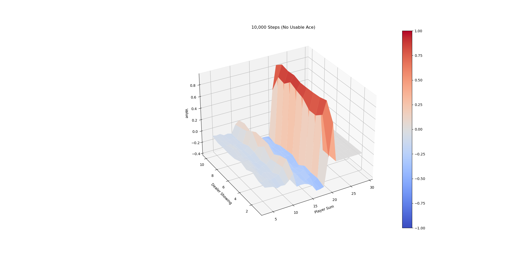
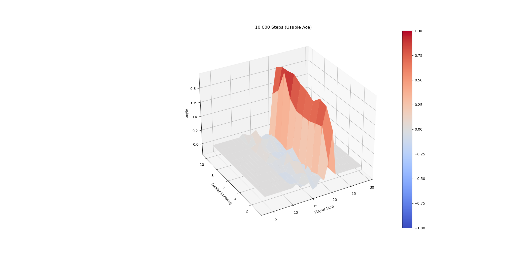
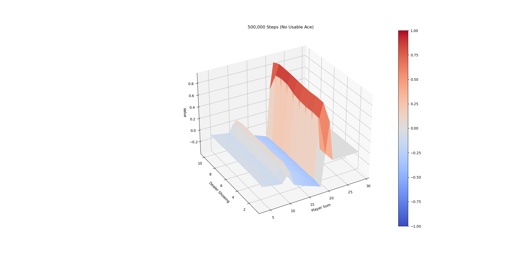

# Monte-Carlo and Temporal Difference Policy Evaluation

Policy is a plan, a set of actions that the agent takes to move through the states. The optimal policy is the set of actions that allows the agent to maximize his rewards. Evaluating the policy is the process of calculating the value of each state when the agent follows the set of actions dictated by that policy. The way to evaluate the policy is MC, is to play episodes of the game until we reach the end, then we grab the rewards collected on the way and move backward to the start of the episode, while affecting the discounted value at each state. We repeat this method a sufficient number of times and we average the value of each state. The Monte-Carlo method requires waiting until the end of the episode to determine V(St). The Temporal Difference of TD method, on the other hand, only needs to wait until the next time step. At time t+1, the TD method used the obsered reward R_t+1 and immediately forms a TD target, updating V(St) with TD error.

In this project, we will apply first-visit MC and TD(0) to reproduce the plots of the value function of the Blackjack problem under the fixed policy that one will stick only  if the sum of cards is greater than or equal to 20.

## Installation

You need to have conda environment with Python>=3.7

```
git clone \
  --depth 1  \
  --filter=blob:none  \
  --sparse \
  https://github.com/joycenerd/RL_2021 \
;
cd RL_2021
git sparse-checkout init --cone
git sparse-checkout set HW2
conda env create -n blackjack -f environment.yml 
```

## How to Run?

```
python mc_td_policy_evaluation.py
```

## Method

* First-visit MC: for each episode, only the first time that the agent arrives at  counts
```
The first time state s appears: N(S)<-N(S)+1
Total rewards update: S(S)<-S(S)+G_t
State s value: V(s)=S(s)/N(s)
When N(s)->infinity, V(s)->v_pi(s): try as many episodes as you can to get as close as possible to the real state s value
```

<table>
    <tr>
        <td>10k episodes with no usable ace</td>
        <td>10k episodes with usable ace</td>
    </tr>
    <tr>
      <td></td>
      <td></td>
    </tr>
    <tr>
        <td>500k episodes with no usable ace</td>
        <td>500k episodes with usable ace</td>
    </tr>
    <tr>
      <td></td>
      <td></td>
    </tr>
</table>

* TD(0)


<table>
    <tr>
        <td>10k episodes with no usable ace</td>
        <td>10k episodes with usable ace</td>
    </tr>
    <tr>
      <td></td>
      <td></td>
    </tr>
    <tr>
        <td>500k episodes with no usable ace</td>
        <td>500k episodes with usable ace</td>
    </tr>
    <tr>
      <td></td>
      <td></td>
    </tr>
</table>

